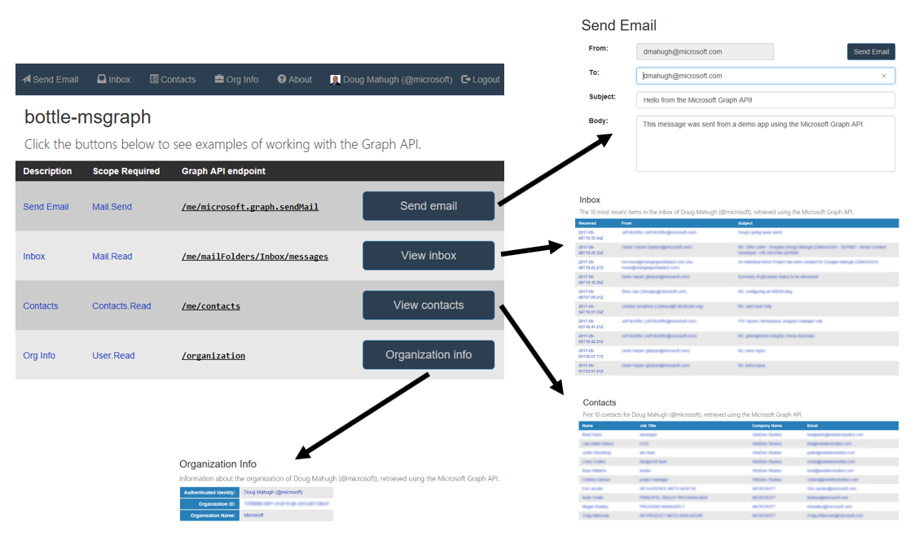

# bottle-msgraph

Sample app based on [Bottle](https://bottlepy.org/docs/dev/) and [Requests](http://docs.python-requests.org/en/master/) that demonstrates how to work with the [Microsoft Graph API](https://developer.microsoft.com/en-us/graph/) in [Python](https://www.python.org/).

* [Installation](docs/Installation)
* [Getting Started](docs/GettingStarted)
* [Overview](docs/Overview)
* [Sample Queries](docs/SampleQueries)
* [OAuth2Manager class](docs/OAuth2Manager)

Pull requests are welcome, or feel free to [log an issue](https://github.com/dmahugh/bottle-msgraph/issues)
if you have a suggestion or run into any issues. Thanks!

*Disclaimer:* this sample is _not_ intended to be production-ready, it's just an educational sample for learning core concepts of the Microsoft Graph API, Azure Active Directory, and OAuth 2.0. To keep the code clear and simple, OAuth2Manager doesn't have much error handling and doesn't implement various details that are essential for a publicly deployed application. ([Validating access tokens](https://docs.microsoft.com/en-us/azure/active-directory/develop/active-directory-token-and-claims#validating-tokens), for example.)

## Where to Learn More

* The [Microsoft Graph API](https://developer.microsoft.com/en-us/graph/) site has a variety of information for Graph developers, including SDKs for many languages, code samples, and documentation.
* The [Oauth 2.0 specification](http://www.rfc-editor.org/rfc/rfc6749.txt) is the official documentation for OAuth2 process flow details. As specs go, it's small (just 75 pages), well-organized, and easy to read. 
* For an overview of how to implement OAuth 2.0 authorization code flow for Azure Active Directory in web apps, see this page: [Authorize access to web applications using OAuth 2.0 and Azure Active Directory](https://docs.microsoft.com/en-us/azure/active-directory/develop/active-directory-protocols-oauth-code)
* The [Open ID Connect specifications](http://openid.net/connect/) are optional reading for most application developers, but it's worth noting that Azure AD only returns refresh tokens if the _offline_access_ scope is included in the requested scopes, as covered in [Section 11](http://openid.net/specs/openid-connect-core-1_0.html#OfflineAccess) of the Open ID Connect [core spec](http://openid.net/specs/openid-connect-core-1_0.html).
