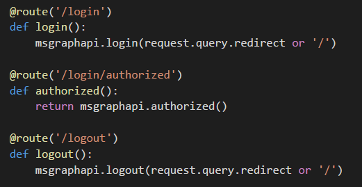
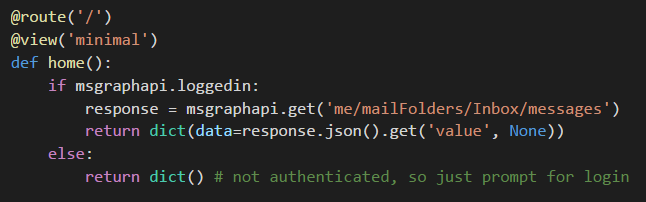
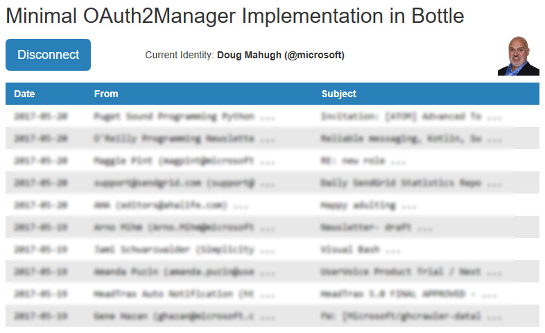

# bottle-msgraph

Simple web app that shows how to connect to the [Microsoft Graph API](https://developer.microsoft.com/en-us/graph/) in Python. This sample does not use an SDK or auth provider, because it was created as an OAuth 2.0 learning exercise.

Authentication functionality is in the [OAuth2Manager](docs/OAuth2Manager) class defined in [oauth2mgr.py](https://github.com/dmahugh/bottle-msgraph/blob/master/oauth2mgr.py), and the methods of OAuth2Manager print console status messages to provide visibility into what's going on. Here's an example of app startup after a cached access token has expired:

For information about how to install and use the sample, see the documentation:

[Installation](docs/Installation) | [Getting Started](docs/GettingStarted) | [Overview](docs/Overview) | [Sample Queries](docs/SampleQueries) | [OAuth2Manager class](docs/OAuth2Manager)

Pull requests are welcome, or feel free to [log an issue](https://github.com/dmahugh/bottle-msgraph/issues)
if you have a suggestion or run into any issues. Thanks!

## Minimal Implementation

An example of a minimal implementation is included in this repo, which may be helpful for those who want to add [OAuth2Manager](docs/OAuth2Manager) to an existing Bottle app, or start an OAuth 2.0-enabled Bottle app from scratch. It's a single-page app that displays the most recent 10 emails from the authenticated user's inbox, and you can launch it by executing the *minapp.py* program and then pointing your browser to *http://localhost:5000/*. You can connect as a Microsoft-managed identity, and you'll see the latest items in your inbox.

The minapp.py program is just a simple launcher for the Bottle app (containing no custom code for this app), and the implementation of OAuth2Manager can be found in the route handlers in *minroutes.py*. The core concept is that you create an instance of OAuth2Manager (named _msgraphapi_ in this example, since it's being used with Microsoft Graph), and then you call methods of OAuth2Manager to handle tasks such as logging in, logging out, and accessing a protected resource.

The three handlers required for authentication are _login_, _logout_, and _authorized_ (which is the target of the Redirect URL that was registered with the application). All three of these route handlers are one-liners that call into the OAuth2Manager object's methods:

The home page of the app checks whether the user is logged in, and if so then it calls the Graph API to get messages from their inbox:

The results of the Graph API call are passed to the HTML template, _minimal.tpl_, which renders the message date, From, and Subject in a table:

## Where to Learn More

* The [Microsoft Graph API](https://developer.microsoft.com/en-us/graph/) site has a variety of information for Graph developers, including SDKs for many languages, code samples, and documentation.
* The [Oauth 2.0 specification](http://www.rfc-editor.org/rfc/rfc6749.txt) is the official documentation for OAuth2 process flow details. As specs go, it's small (just 75 pages), well-organized, and easy to read. 
* For an overview of how to implement OAuth 2.0 authorization code flow for Azure Active Directory in web apps, see this page: [Authorize access to web applications using OAuth 2.0 and Azure Active Directory](https://docs.microsoft.com/en-us/azure/active-directory/develop/active-directory-protocols-oauth-code)
* The [Open ID Connect specifications](http://openid.net/connect/) are optional reading for most application developers, but it's worth noting that Azure AD only returns refresh tokens if the _offline_access_ scope is included in the requested scopes, as covered in [Section 11](http://openid.net/specs/openid-connect-core-1_0.html#OfflineAccess) of the Open ID Connect [core spec](http://openid.net/specs/openid-connect-core-1_0.html).
