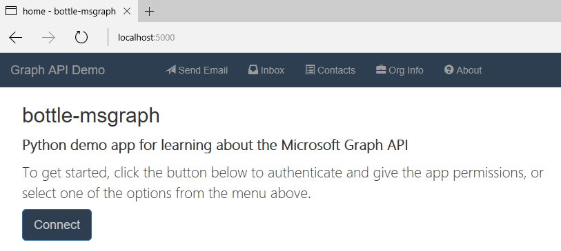
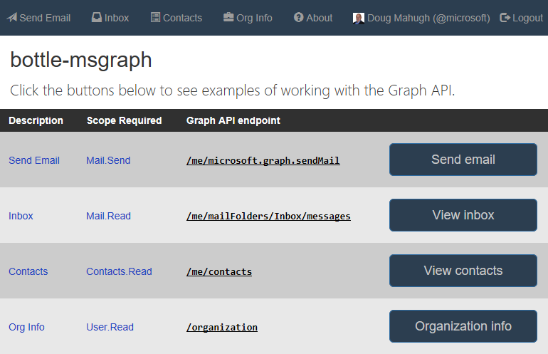

# Getting Started

[Installation](../Installation/readme.md) | [Getting Started](../GettingStarted/readme.md) | [Overview](../Overview/readme.md) | [Sample Queries](../SampleQueries/readme.md) | [OAuth2Manager class](../OAuth2Manager/readme.md) | [repo home](https://github.com/dmahugh/bottle-msgraph)

After [Installation](../Installation/readme.md), the next step is to create a ```config.json``` file. The sample app will read your Azure AD credentials from this file on startup. Follow these steps to set up your ```config.json``` file:

* Save a copy of the [config.json template](https://github.com/dmahugh/bottle-msgraph/blob/master/docs/misc/config.json) in the root folder of your project
* Go to the [Microsoft Application Registration Portal](https://apps.dev.microsoft.com/) and sign in, then click on the "Add an app" button
* Give the application a name, and click Create
* Note the value labeled *Application ID* &mdash; this is the value to copy and paste into config.json for _"app_id"_
* Under Platforms, click "Add Platform" and select "Web"
* Set the Redirect URL to ```http://localhost:5000/login/authorized``` and click Save
* Click on "Generate New Password" and then copy the displayed value and paste it into config.json for the _"app_secret"_ value

Save your changes to ```config.json```, and you're ready to run the app. In the root folder, use this command to start the server: ```python app.py```

Then navigate to [http://localhost:5000/](http://localhost:5000/) in a web browser, and you should see this page:



Click the Connect button and authenticate under any identity managed by Azure AD, and then you'll be one click away from trying out any of the sample queries listed:



