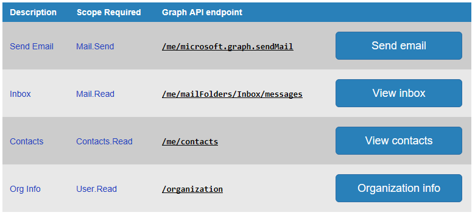

# Getting Started

[Installation](../Installation/readme.md) | [Getting Started](../GettingStarted/readme.md) | [Overview](../Overview/readme.md) | [Sample Queries](../SampleQueries/readme.md) | [OAuth2Manager class](../OAuth2Manager/readme.md) | [repo home](https://github.com/dmahugh/bottle-msgraph)

## configuration OAuth2Manager

After [Installation](../Installation/readme.md), the next step is to configure the OAuth2Manager instance with the information needed to connect to Azure Active Directory and obtain a valid access token. You can put all of these settings in a JSON configuration file, hard-code them into a _config_ dictionary in the source code, or do a combination of the two approaches.

To create a configuration file, copy the [config.json template](https://github.com/dmahugh/bottle-msgraph/blob/master/docs/misc/config.json) into the root folder of your project, and edit it to add your application's name, ID, and secret. You will obtain those settings when you register your application with your Azure AD tenant:

* Go to the [Microsoft Application Registration Portal](https://apps.dev.microsoft.com/) and sign in, then click on the "Add an app" button
* Give the application a name, and click Create
* Note the value labeled *Application ID* &mdash; this is the value to copy and paste into config.json for _"app_id"_
* Under Platforms, click "Add Platform" and select "Web"
* Set the Redirect URL to ```http://localhost:5000/login/authorized``` and click Save
* Click on "Generate New Password" and then copy the displayed value and paste it into config.json for the _"app_secret"_ value

Save your changes to ```config.json```, and you're ready to run the app.

## starting the application

Depending on how you've installed and configured Python on your system, use one of these commands in the root folder to start the application:

```
python app.py
python3 app.py
py -3 app.py
```

Then navigate to [http://localhost:5000/](http://localhost:5000/) in a web browser, and you should see a page with a _Connect_ button. Click the button and authenticate under any identity managed by Azure AD, and then you'll be one click away from trying out any of the sample queries listed:



## About Page

The About page shows a summary of Auth Status, System Information, and Python Environment:


Note that it also includes buttons to connect/disconnect, refresh the current access token, and clear the local cache. The handlers for these buttons redirect back to the About page, so that you can see how these changes interact with the current state of the application.
