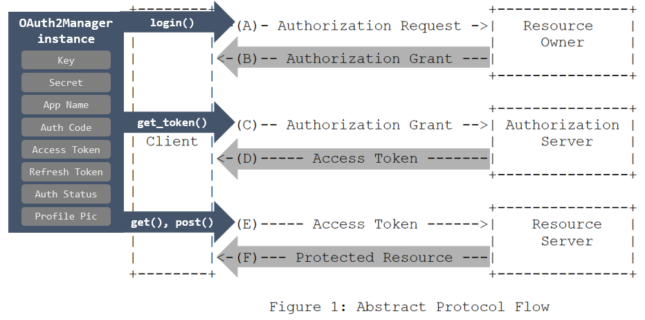

# OAuth2Manager class

[Installation](../Installation/readme.md) | [Getting Started](../GettingStarted/readme.md) | [Overview](../Overview/readme.md) | [Sample Queries](../SampleQueries/readme.md) | [OAuth2Manager class](../OAuth2Manager/readme.md) | [repo home](https://github.com/dmahugh/bottle-msgraph)

This class handles the details of obtaining an authorization code and access token from Azure Active Directory, and provides wrappers for making authenticated calls to the Microsoft Graph API. It is intended to be used as a learning tool, with a local application running on a test server. For a sample implementation, see [https://github.com/dmahugh/bottle-msgraph](https://github.com/dmahugh/bottle-msgraph).

Restrictions:

* OAuth2Manager is intended to be used with the Bottle web framework, and it uses Bottle's _redirect_ method and _request_ object for convenience and code simplicity.
* This is _sample_ code for learning about OAuth 2.0, and does not include many security best practices. **Do not use this code in production.**
* This code is based on the [OAuth 2.0 specification](http://www.rfc-editor.org/rfc/rfc6749.txt), and it _should_ work with other OAuth 2.0 providers but has only been tested with Azure Active Directory and the Microsoft Graph API.
* The only OAuth 2.0 grant type supported is Authorization Code Grant, which is the most commonly used process flow for web apps. At this time, no support is provided for the other grant types: Implicit Grant, Resource Owner Password Credentials Grant, and Client Credentials Grant.

The methods of OAuth2Manager handle the steps in OAuth 2.0 process flow as show here on a diagram from the [Oauth 2.0 spec](http://www.rfc-editor.org/rfc/rfc6749.txt):



## load_settings() method

This method is called by ```__init__``` to load configuration settings from a ```config.json``` file, as covered in [Getting Started](../GettingStarted/readme.md). The config.json file should have this format:

```json
{
    "app_name": "bottle-msgraph",
    "app_id": "<value from app registration portal>",
    "app_secret": "<value from app registration portal>",
    "redirect_url": "http://localhost:5000/login/authorized",
    "scopes": [
        "User.Read",
        "Mail.Send",
        "Mail.Read",
        "Contacts.Read",
        "offline_access"],
    "api_base": "https://graph.microsoft.com/v1.0/",
    "auth_base": "https://login.microsoftonline.com/common/oauth2/v2.0/authorize",
    "token_url": "https://login.microsoftonline.com/common/oauth2/v2.0/token"
}
```

## login() method

This method handles authentication. In the [sample app](https://github.com/dmahugh/bottle-msgraph), we use a ```/login``` route with a login() handler function that simply calls the method:

```python
@route('/login')
def login():
    """Handler for /login endpoint."""
    msgraphapi.login(request.query.redirect or '/')
```

## authorized() method

After a successful login, Azure AD redirects the browser to the _Redirect URL_ that we provided when we registered the app in the [Application Registration Portal](https://apps.dev.microsoft.com/):

```http://localhost:5000/login/authorized```

Here's the implementation of a handler for that route in the Bottle-based sample app:

```python
@route('/login/authorized')
def authorized():
    """Handler for login/authorized route."""
    return msgraphapi.authorized()
```

The authorized() method receives the authorization grant from Azure AD and pass it to get_token().

## get_token() method

This method retrieves the access token and saves it and related information (expiration time, refresh token) to properties of the OAuth2Manager object, making it ready to handle authentication for calls to the Graph API.

## get() method, post() method

These are wrappers to HTTP Get/Put. They can take relative URLs for API endpoints (e.g., ```/organization```), and they send the current access token with each request.

They take an optional dictionary of HTTP headers, which can override or add to these default HTTP headers:

```json
{
  "User-Agent" : "bottle-msgraph/1.0",
  "Authorization" : "<access token>",
  "Accept" : "application/json",
  "Content-Type" : "application/json",
  "client-request-id" : "<guid>",
  "return-client-request-id" : "true"
}
```
