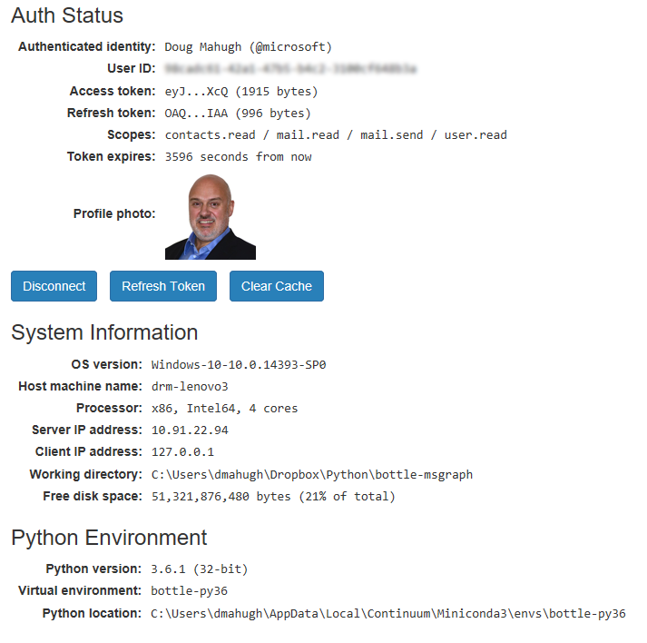

# Sample Queries

[Installation](../Installation/readme.md) | [Getting Started](../GettingStarted/readme.md) | [Overview](../Overview/readme.md) | [Sample Queries](../SampleQueries/readme.md) | [OAuth2Manager class](../OAuth2Manager/readme.md) | [repo home](https://github.com/dmahugh/bottle-msgraph)

Below are brief descriptions of the source code files and Graph API sample queries included in the app.

## Source Code

### routes.py

The [routes.py](https://github.com/dmahugh/bottle-msgraph/blob/master/routes.py) source file contains the function definitions for all of the routes handled by the application, such as ```/login```, ```/logout```, and ```/sendmail```.

Note that an instance of ```OAuth2Manager``` named ```msgraphapi``` is created at the top of the file:

```python
import oauth2mgr
msgraphapi = oauth2mgr.OAuth2Manager()
```
The ```msgraphapi```object tracks authentication state and provides methods for handling login, logout, and authenticated calls to the Graph API.

### oauth2mgr.py

The ```OAuth2Manager``` class in 
[oauth2mgr.py](https://github.com/dmahugh/bottle-msgraph/blob/master/oauth2mgr.py)
handles authentication details. [This page covers how to use OAuth2Manager.](OAuth2Manager/readme.md)

### app.py

The [app.py](https://github.com/dmahugh/bottle-msgraph/blob/master/app.py) source file launches the Bottle app, running under a local test server. This is boilerplate Bottle code, from the Azure template for Bottle deployments &mdash; the only changes for this demo were the addition of this line to import the route handlers:

```python
import routes # HTTP handlers for all routes
```

### about.py

This file defines the sysinfo() function to return information about the runtime environment, as displayed on the [About page](../images/about.png).

## Sample Queries

The _Send Email_ example uses the Graph API's ```/me/microsoft.graph.sendMail``` endpoint to send an email on behalf of the current user. An HTML form is provided for entering the destination email, subject, and message body:


The _Inbox_ example uses the Graph API's ```/me/mailFolders/Inbox/messages``` to retrieve the most recent 10 emails from the user's email inbox:


The _Contacts_ example uses the Graph API's ```/me/contacts``` endpoint to retrieve the first 10 contacts for the current user:


The _Org Info_ example uses the Graph API's ```/organization``` endpoint to retrieve information about the current user's organization:


## About Page

The About page shows a summary of Auth Status, System Information, and Python Environment:


